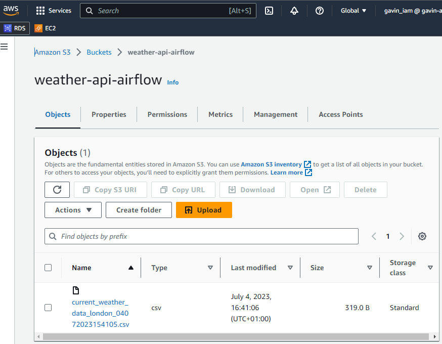

# Python-Airflow-Pipeline

<h1 align="center">
   
 
 
</h1>

## Features

* Extracted current weather data from open weather map API
* Transformed and loaded the data into an S3 bucket using Apache Airflow
